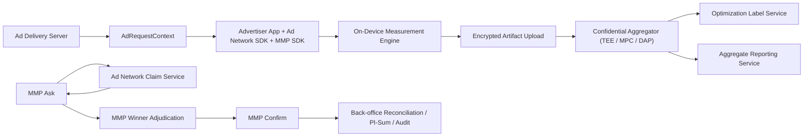

# On-Device Measurement RFC

状态: Draft  
最后更新: 2026-04-28  
适用对象: Ad Network, Advertiser App, MMP, SRN, Privacy/Infra/ML 工程团队

## 1. 目标

本文将 on-device measurement 从“概念”整理为一份可用于系统设计、协议设计、数据建模和生产落地的 RFC，覆盖广告测量与优化场景，尤其是与 MMP 的 SRN 流程协同时的端到端规范。

本文回答七个核心问题：

1. 什么是 on-device measurement，它真正解决什么问题。
2. 截至 2026-04-28，最新研究和标准化进展对系统设计意味着什么。
3. 在广告场景下，如何同时满足 measurement、optimization、reconciliation 三类需求。
4. 如何把敏感信号尽量留在设备侧，同时避免服务端失去足够的优化粒度。
5. 如何兼容 `MMP Ask -> Ad Network Claim -> MMP Confirm` 这一 SRN 工作流。
6. 如何处理广告 SDK 在广告主 App 内采集到的高敏感信号，例如 `boot_time`、`ip`、`device_uptime`、粗粒度网络属性等。
7. 如何优先采用成熟协议和三方库，而不是 toy 算法。

## 2. 非目标

本文不是：

- 某家厂商私有实现的泄露版文档。
- 单篇论文的翻译。
- 只讲公式、不讲系统边界的研究笔记。
- 把“隐私测量”退化成“明细日志换个名字继续上传”。

## 3. 一句话定义

`On-device measurement` 是一种数据最小化架构：原始用户事件和敏感设备信号优先保留在设备侧，设备只上传任务受限、生命周期受限、贡献受限的 measurement artifact；服务端只在受控边界内做 join、归因、聚合、训练样本构造和对账，并向不同下游释放不同粒度的结果。

## 4. 背景与设计压力

广告测量系统同时承受三类压力：

- 业务侧需要安装、激活、购买、留存、LTV、reach、frequency、incrementality。
- 优化侧需要把转化尽量关联回某次 ad request、某次竞价、某个 creative、某条流量路径。
- 隐私与合规侧不能把稳定用户标识、完整事件序列、长期可链接轨迹明文回传。

传统“全量事件回传 + 中心化归因”的主要问题是：

- 服务端拿到过多用户级明细。
- request log、click log、conversion log 很容易被拼成长链路画像。
- 一旦为了优化保留 request 级细粒度数据，measurement 与 optimization 会一起突破最小化边界。

因此，本 RFC 采用三层输出面：

1. `Confidential Raw Plane`
2. `Optimization Label Plane`
3. `Aggregate Reporting Plane`

## 5. 最新研究与标准化结论

本节只保留对架构设计真正有影响的结论。日期均以 2026-04-28 为基准核对。

### 5.1 Mayfly 证明“设备侧短生命周期流 + 受限查询模板 + 流式 DP”可以工程化

Google Research 在 2024 年发表 *Mayfly: Private Aggregate Insights from Ephemeral Streams of On-Device User Data*。它的重要结论是：

- 设备侧不必只做一个 hash 或 token。
- 更完整的形态是：设备保留短期原始流，只执行预定义模板查询，再上传最小化结果。
- 对 count、sum、group-by-sum 一类 workload，可以优先使用设备侧窗口化、contribution bounding 和 streaming DP。

对本 RFC 的含义：

- install、purchase、value sum、分桶统计等任务优先考虑“设备侧窗口化 + 受控聚合上报”。
- `measurement_task_id`、查询模板、贡献上限、privacy budget ledger 必须是一等公民。

### 5.2 Confidential Federated Computations 把“别信服务端”变成了工程能力

Google Research 在 2024 年发表 *Confidential Federated Computations*，Google Research 又在 2025-01-22 通过 Parfait 公布了更多可复用组件。

核心结论：

- 服务端聚合逻辑可以运行在 TEE 中。
- 客户端可以验证“真正运行的就是公开代码”。
- 隐私预算、密钥管理、可验证执行可以成为系统的一部分，而不是制度假设。

对本 RFC 的含义：

- `server_request_id`、`auction_id` 这类 request 级字段不必暴露给普通分析链路。
- 它们只应进入 `confidential raw plane`，在 TEE 中完成 join、归因、去重、频控分析和训练样本生成。
- 之后只释放 request-scoped label 或 aggregate result。

### 5.3 DAP/VDAF 已经成熟到值得对齐对象模型

截至 2026-04-28：

- IETF `draft-ietf-ppm-dap-17` 最后更新于 2026-01-30。
- IRTF `draft-irtf-cfrg-vdaf-19` 最后更新于 2026-04-14。

它们对本 RFC 的价值不在于“已经是正式 RFC”，而在于：

- 客户端 report、aggregator share、aggregate result 的对象分层已经比较稳定。
- `Prio3` 风格 workload 很适合 count、sum、histogram、bounded numeric vector。
- replay protection、task binding、batch collection 等协议概念可直接复用。

因此，本 RFC 的数据模型尽量对齐：

- `client artifact`
- `aggregation task`
- `report batch`
- `aggregate release`

### 5.4 优化训练阶段不能只靠全量明文样本

Google Research 在 2024 年发表 *Training Differentially Private Ad Prediction Models with Semi-Sensitive Features* 与 *On Convex Optimization with Semi-Sensitive Features*。

关键结论：

- 广告优化中，并非所有 feature 都必须按同样强度保护。
- 一部分 feature 可以视为攻击者已知，另一部分 feature 与 label 仍需 DP 保护。
- 相比“对所有字段直接做 DP-SGD”，semi-sensitive / label-sensitive 路径更实用。

对本 RFC 的含义：

- `RequestScopedOptimizationLabel` 应只保留必要字段。
- 训练面应该区分：
  - 已知 auction/delivery feature
  - 敏感设备侧或转化侧 feature
  - label 本身
- 训练组件优先使用成熟 DP 训练库，而不是手写梯度裁剪和 accountant。

### 5.5 2025 之后的趋势：不只做 count，也做结构化 insight

Google 在 2025-10-30 发布 *Toward provably private insights into AI use*，并有 2025 年论文 *Differentially Private Insights into AI Use*。

这说明：

- confidential federated analytics 不只做简单计数。
- 也可以在受控边界内做结构化分类、summarization、topic histogram。
- 但 release discipline 仍然必须是 contribution bounding + DP + thresholding + audit。

对广告场景的启发：

- on-device measurement 的输出不应只局限于 installs 和 purchases。
- 在受控边界内，还可以构造更复杂的训练标签和质量分析标签。
- 但这些 richer insights 不能直接流入普通报表。

### 5.6 与产品现实的对齐

Google Ads 与 Firebase 在 2025 年的公开文档已经明确：

- iOS App campaigns 存在官方 on-device conversion measurement 能力。
- 方案分为基于 first-party data 的路径，以及基于去标识、临时 event data 的路径。
- 独立 SDK `GoogleAdsOnDeviceConversion` 明确提到会引入“additional de-identified, temporary signals”，包括由 IP 相关属性推导出的临时信号，用于优化和报告。

对本 RFC 的直接含义：

- “敏感信号完全不能碰”不是现实工程约束。
- 真正的边界应该是：是否原样上传、是否跨任务复用、是否形成长期稳定标识、是否暴露给普通数据面。

## 6. 设计原则

### 6.1 总原则

- 原始用户事件 `MUST` 优先保留在设备侧。
- 敏感设备信号 `MUST` 先分类，再决定是否允许进入受控上传路径。
- 上传对象 `MUST` 是任务特定 artifact，而不是通用行为明细。
- 每台设备、每个 measurement task、每个 attribution scope 的贡献 `MUST` 有明确上限。
- request 级标签与 aggregate reporting `MUST` 分层治理。
- 所有 release `MUST` 挂在 privacy budget ledger 下。

### 6.2 广告优化额外原则

- 每次 ad request `MUST` 由服务端生成唯一 `server_request_id`。
- 设备回传 artifact `SHOULD` 能关联该 request，但关联值只能存在于受控平面。
- `server_request_id` `MUST NOT` 被当作长期用户标识。
- optimization 所需的 request-scoped label `MUST` 与 BI/reporting 物理或逻辑隔离。
- 面向 MMP 的前台 claim API `MUST` 只暴露 `yes/no + claim_token` 或同等级最小集合。

### 6.3 敏感信号原则

对于 `boot_time`、`ip`、`device_uptime_ms`、`network_type`、`os_build`、`timezone_offset_min` 等信号：

- 原始值 `MUST NOT` 直接进入 reporting plane。
- 原始值 `SHOULD NOT` 直接进入普通优化样本。
- 如确有反作弊或归因增益需求，`MAY` 进入 `confidential raw plane`，但必须：
  - 明确任务用途
  - 设置最短可行 TTL
  - 做 bucketization / derivation / truncation
  - 禁止跨 task 复用
  - 禁止作为长期 join key

## 7. 信任边界与三层数据面

### 7.1 参与方

- `Ad Delivery Server`
- `Advertiser App`
- `Ad Network SDK`
- `MMP SDK`
- `On-Device Measurement Engine`
- `Upload Gateway`
- `Confidential Aggregator`
- `Optimization Label Service`
- `Reporting Service`
- `MMP Service`
- `Ad Network Claim Service`
- `Privacy Budget Ledger`

### 7.2 三层输出面

#### 7.2.1 Confidential Raw Plane

只在 TEE / MPC / 双聚合方边界内可见，允许包含：

- `server_request_id`
- `auction_id`
- `claim_token`
- 去重键
- 受控短期敏感衍生特征
- task-specific token

禁止：

- 人工直接查询
- 通用 BI SQL
- 无限期保留

#### 7.2.2 Optimization Label Plane

允许 request-scoped 输出，但只包含训练或在线回流最小字段集，例如：

- `server_request_id`
- `label_type`
- `label_value`
- `conversion_delay_sec`
- `attribution_confidence`
- `measurement_task_id`

必须：

- 严格 TTL
- purpose-based ACL
- 不含稳定用户标识

#### 7.2.3 Aggregate Reporting Plane

只包含聚合结果，必须经过：

- minimum crowd threshold
- contribution bounding
- DP
- release audit

## 8. 端到端架构



## 9. 数据分类

### 9.1 设备侧原始数据

设备侧可能存在以下原始对象：

- `local_user_id: int64`
- `local_install_id: uuid`
- `event_log[]`
- `exposure_log[]`
- `consent_state`
- `app_account_signals`
- `device_signal_snapshot`

这些对象 `MUST NOT` 明文直接进入服务端普通数据面。

### 9.2 敏感设备信号分级

#### P0: 禁止上传原始值

- `boot_time_ms`
- `public_ip`
- `local_ip`
- `ssid`
- `bssid`
- `idfa`
- `gaid`
- `email`
- `phone`

#### P1: 仅允许上传衍生值到 confidential plane

- `boot_time_bucket`
- `ip_prefix_class`
- `network_asn_bucket`
- `uptime_bucket`
- `os_build_bucket`
- `device_clock_skew_bucket`

#### P2: 可进入优化或聚合的低敏感上下文

- `country_code`
- `app_version_major`
- `os_major`
- `ad_surface`
- `placement_id`

### 9.3 服务端广告上下文

- `server_request_id: uuid`
- `auction_id: uuid`
- `campaign_id: int64`
- `ad_group_id: int64`
- `creative_id: int64`
- `publisher_id: int64`
- `placement_id: string`
- `bid_price_micros: int64`
- `predicted_ctr_micros: int64`
- `predicted_cvr_micros: int64`
- `delivery_timestamp_ms: int64`

## 10. 核心对象模型

以下 schema 是工程化 mock，不追求与任何单一厂商 API 一字不差。

### 10.1 AdRequestContext

由广告服务端下发，供设备侧缓存：

```json
{
  "schema_version": 1,
  "server_request_id": "01961d5d-3bbd-7fa0-8d1e-8d0f6b4c8c7a",
  "auction_id": "01961d5d-3ba2-7f44-b8da-0e38a44ad1a1",
  "campaign_id": 1200456789012345,
  "ad_group_id": 1200456789012999,
  "creative_id": 1200456789013777,
  "publisher_id": 3100000042,
  "placement_id": "home_feed_top_01",
  "ad_surface": "app_open_interstitial",
  "country_code": "US",
  "delivery_timestamp_ms": 1777339205123,
  "expiry_time_ms": 1777944005123,
  "measurement_task_id": "purchase_value_us_v4",
  "optimization_task_id": "cvr_request_label_v3",
  "token_public_key_id": "kp-2026-04",
  "consent_snapshot": {
    "eea": false,
    "ad_user_data": true,
    "ad_personalization": true
  }
}
```

要求：

- `server_request_id` `MUST` 全局唯一，推荐 `UUIDv7`。
- `expiry_time_ms` `MUST` 限制 request 可参与 join 的生命周期。
- `measurement_task_id` `MUST` 绑定用途，禁止跨任务复用。

### 10.2 LocalExposureRecord

```json
{
  "server_request_id": "01961d5d-3bbd-7fa0-8d1e-8d0f6b4c8c7a",
  "campaign_id": 1200456789012345,
  "creative_id": 1200456789013777,
  "interaction_type": "click",
  "interaction_time_ms": 1777339206128,
  "attribution_window_hours": 168,
  "measurement_task_id": "purchase_value_us_v4"
}
```

### 10.3 LocalConversionEvent

```json
{
  "local_user_id": 8237492219901,
  "event_id": "evt-7f1d5c0d6d9f4b61",
  "event_type": "purchase",
  "event_time_ms": 1777425602123,
  "value_micros": 12990000,
  "currency": "USD",
  "order_id": "ord_20260428_100045",
  "product_category": "subscription",
  "is_first_purchase": true
}
```

要求：

- `local_user_id` `MAY` 是业务内 `int64`，但 `MUST NOT` 直接上传。
- `order_id` 默认仅用于设备侧去重。

### 10.4 DeviceSignalSnapshot

此对象用于表达“App 内广告 SDK 采集了敏感 PII”的现实。

```json
{
  "captured_at_ms": 1777425601120,
  "public_ip": "203.0.113.24",
  "boot_time_ms": 1776021000000,
  "device_uptime_ms": 1404601120,
  "network_type": "wifi",
  "timezone_offset_min": -420,
  "os_build": "22E772610a"
}
```

要求：

- 此对象 `MUST` 默认只存在于设备侧。
- 原始 `public_ip`、`boot_time_ms` `MUST NOT` 直接进入 reporting plane。
- 如某 task 允许其参与反作弊或归因，必须先转为衍生对象。

### 10.5 EphemeralSensitiveFeatureVector

```json
{
  "schema_version": 1,
  "feature_set_id": "fraud_signals_v2",
  "derived_at_ms": 1777425601150,
  "boot_time_bucket": "2026-04-12",
  "uptime_bucket": "1d_to_7d",
  "ip_prefix_class": "us_ca_mobile",
  "network_type": "wifi",
  "clock_skew_bucket": "lt_5s",
  "ttl_sec": 86400
}
```

说明：

- 这是敏感原始值的任务特定、短生命周期衍生表示。
- `ttl_sec` 到期后 `MUST` 删除。

### 10.6 OnDeviceMeasurementArtifact

```json
{
  "schema_version": 2,
  "artifact_id": "art-01961e8f9a2a",
  "artifact_type": "conversion_measurement",
  "measurement_task_id": "purchase_value_us_v4",
  "server_request_id": "01961d5d-3bbd-7fa0-8d1e-8d0f6b4c8c7a",
  "event_time_bucket_minute": 29623760,
  "conversion_type": "purchase",
  "bounded_value_micros": 12990000,
  "currency": "USD",
  "odm_token": "base64url:XYZr_AB8C-_zGtKjUhqtzPLeQ8lbJB5dADVR0tpZ9f...",
  "derived_sensitive_features": {
    "feature_set_id": "fraud_signals_v2",
    "boot_time_bucket": "2026-04-12",
    "ip_prefix_class": "us_ca_mobile"
  },
  "consent_snapshot": {
    "eea": false,
    "ad_user_data": true,
    "ad_personalization": true
  },
  "privacy_metadata": {
    "contribution_scope": "device_per_campaign_per_day",
    "max_reports_in_scope": 3,
    "epsilon_hint": 0.0
  }
}
```

要求：

- `server_request_id` 仅用于 confidential join 和 label 构造。
- `odm_token` `SHOULD` 带过期时间、anti-replay nonce、task binding。
- `derived_sensitive_features` `MUST NOT` 包含稳定标识。

### 10.7 RequestScopedOptimizationLabel

```json
{
  "schema_version": 1,
  "server_request_id": "01961d5d-3bbd-7fa0-8d1e-8d0f6b4c8c7a",
  "label_type": "purchase",
  "label_value": 1,
  "value_micros": 12990000,
  "currency": "USD",
  "attribution_model": "last_click_on_device",
  "attribution_confidence": 0.93,
  "conversion_delay_sec": 86396,
  "measurement_task_id": "purchase_value_us_v4",
  "privacy_tier": "request_scoped_confidential",
  "created_at_ms": 1777425604123
}
```

要求：

- `MUST NOT` 包含 `local_user_id`、邮箱、手机号、IDFA、GAID。
- `MUST` 设置严格 TTL，建议 30-90 天。
- 普通报表系统 `MUST NOT` 直接查询此表。

### 10.8 AggregateMeasurementResult

```json
{
  "schema_version": 1,
  "measurement_task_id": "purchase_value_us_v4",
  "grouping_keys": {
    "campaign_id": 1200456789012345,
    "country_code": "US",
    "event_date": "2026-04-28"
  },
  "metrics": {
    "installs": 1287,
    "purchasers": 229,
    "purchase_value_micros": 4387710000,
    "dp_noise_interval_95pct": {
      "installs": 18,
      "purchasers": 9,
      "purchase_value_micros": 120000000
    }
  },
  "privacy_release_metadata": {
    "min_group_size": 128,
    "epsilon_spent": 0.35,
    "delta": 1e-9,
    "threshold_passed": true
  }
}
```

## 11. 与 MMP/SRN 的关系

本 RFC 假设系统需兼容如下现实链路：

1. MMP 持有 conversion。
2. MMP 向多个 ad network 发起 claim ask。
3. ad network 只回 `yes/no` 或 `yes/no + claim_token`。
4. MMP 做 winner adjudication，例如 last click。
5. MMP 向 winner network 发送 confirm/finalize。
6. 后台再做 reconciliation、settlement 或 aggregate verification。

关键结论：

- `MMP Ask -> Ad Network Claim -> MMP Confirm` 是前台资格判定协议。
- on-device measurement 是设备侧最小化与服务端受控聚合框架。
- 两者不是替代关系，而是前后衔接关系。

## 12. SRN 协议对象

### 12.1 ClaimRequest

```json
{
  "request_id": "req_20260428_00017_netA",
  "mmp_id": "mmp_demo",
  "network_id": "netA",
  "conversion_id": "conv_20260428_00017",
  "query_hash": "qh_26f4ad7d",
  "query_schema_version": "claim_v1",
  "conversion_ts_bucket": "2026-04-28T10:20:00Z/5m",
  "event_name": "purchase",
  "app_id": "com.example.shop",
  "device_scoped_query_key": "qk_9f2e1d5174",
  "query_nonce": "n_7d2a8e"
}
```

要求：

- `conversion_ts_bucket` 必须桶化，避免精确时间探测。
- `device_scoped_query_key` 必须是短生命周期、task-specific 查询键。

### 12.2 ClaimResponse

```json
{
  "request_id": "req_20260428_00017_netA",
  "network_id": "netA",
  "claim": "yes",
  "claim_token": "opaque-claim-token",
  "policy_version": "pv_20260428_01",
  "response_expiry_ts": "2026-04-28T10:25:00Z",
  "response_signature": "sig_netA_resp_7c1"
}
```

约束：

- `claim = no` 时 `claim_token` 为空。
- `claim = yes` 时 `claim_token` 必填。
- `MUST NOT` 返回 click timestamp、campaign id、touch type 等额外信息。

### 12.3 FinalizeRequest

```json
{
  "request_id": "fin_20260428_00017_netA",
  "conversion_id": "conv_20260428_00017",
  "network_id": "netA",
  "claim_token": "opaque-claim-token",
  "winner_model": "last_click_v1",
  "finalized_at": "2026-04-28T10:20:16Z"
}
```

### 12.4 FinalizeResponse

```json
{
  "request_id": "fin_20260428_00017_netA",
  "accepted": true,
  "settlement_ref": "set_20260428_7751",
  "response_signature": "sig_netA_fin_8a2"
}
```

## 13. 端到端流程

### 13.1 Flow A: 单平台 conversion measurement

1. 广告服务端生成 `server_request_id` 并下发 `AdRequestContext`。
2. 设备缓存最小曝光记录和 request context。
3. 广告主 App 内的 ad network SDK / MMP SDK 采集事件与可用信号。
4. on-device engine 做候选筛选、去重、贡献裁剪和 token 生成。
5. 设备上传 `OnDeviceMeasurementArtifact` 到 upload gateway。
6. confidential aggregator 在 TEE/MPC 边界内做 join、归因、去重、预算扣减。
7. 输出两类结果：
   - `RequestScopedOptimizationLabel`
   - `AggregateMeasurementResult`

### 13.2 Flow B: MMP + SRN 前台 ask/claim/confirm

1. MMP 记录 conversion。
2. MMP 向多个 network 发送 `ClaimRequest`。
3. network 内部执行 `eligible_to_claim(query) -> bool`。
4. network 返回 `ClaimResponse`。
5. MMP 依据规则做 winner adjudication。
6. MMP 只向 winner 发送 `FinalizeRequest`。
7. winner network 校验 `claim_token` 并确认。

### 13.3 Flow C: 后台 reconciliation / settlement

1. MMP 与 network 周期性运行 PI-Sum / PSI / confidential aggregation。
2. 产出 campaign 级 matched conversions、value sum、delta。
3. 不暴露用户级明细。

## 14. Worked Example

假设：

- 用户在 2026-04-28T10:01:12Z 点击了 Network A 广告。
- 用户在 2026-04-28T10:04:35Z 点击了 Network B 广告。
- 用户在 2026-04-28T10:20:08Z 完成 purchase。
- 归因规则是 7 天 last click。

### 14.1 MMP ask 结果

```json
[
  {
    "network_id": "netA",
    "claim": "yes",
    "claim_token": "ctok_netA_a1"
  },
  {
    "network_id": "netB",
    "claim": "yes",
    "claim_token": "ctok_netB_b1"
  },
  {
    "network_id": "netC",
    "claim": "no",
    "claim_token": null
  }
]
```

### 14.2 MMP adjudication

winner 是 `Network B`。

### 14.3 confidential label

```json
{
  "server_request_id": "01961d5d-3bbd-7fa0-8d1e-8d0f6b4c8c7a",
  "label_type": "purchase",
  "label_value": 1,
  "value_micros": 12990000,
  "conversion_delay_sec": 86396,
  "measurement_task_id": "purchase_value_us_v4"
}
```

### 14.4 aggregate reporting

同一事件在 reporting plane 只以聚合形式出现，不再暴露 request 粒度数据。

## 15. 设备侧行为规范

### 15.1 本地存储

设备侧至少维护：

- `request_context_cache`
- `exposure_log`
- `conversion_event_dedup_log`
- `sensitive_signal_cache`

建议：

- `exposure_log` 使用 ring buffer。
- `request_context_cache` 只保留归因窗口内任务相关字段。
- `sensitive_signal_cache` 默认 24h 以内过期。

### 15.2 候选筛选

设备侧 `SHOULD` 在上传前完成第一轮候选缩减：

- install 只保留窗口内最近一次 click 和最近一次 impression。
- purchase 只保留同 task 下最近 `N` 次 request，推荐 `N=1..3`。
- 对同 `order_id` 重复事件做设备侧去重。

### 15.3 贡献约束

默认建议值：

- `max_conversion_reports_per_device_per_campaign_per_day = 3`
- `max_value_micros_per_device_per_campaign_per_day = 100000000`
- `max_reach_reports_per_device_per_campaign_per_day = 1`

超限后 `MUST` 做裁剪、采样或先局部聚合再上传。

## 16. 服务端行为规范

### 16.1 Upload Gateway

职责尽量薄：

- 鉴权
- schema 校验
- 限流
- 写入加密队列
- 不做用户级 join

### 16.2 Confidential Aggregator

这是最关键的受控边界，`MUST` 负责：

- artifact 解密或 share 聚合
- anti-replay
- request 有效期校验
- task 预算检查
- request-scoped label 构造
- aggregate result 构造

它 `SHOULD` 运行在：

- TEE
- 或双聚合方 DAP/VDAF
- 或 MPC / PJC 服务

### 16.3 Privacy Budget Ledger

至少记录：

- `measurement_task_id`
- query template
- epsilon / delta
- contribution bounds
- min group size
- release 审批和时间
- 允许的下游用途

任何 aggregate output `MUST` 先经过 ledger。

## 17. 查询模板

为了避免系统退化成明细仓库，本 RFC 采用预定义 query template。

### 17.1 安装归因

分组维度：

- `campaign_id`
- `country_code`
- `event_date`

指标：

- installs
- reinstalls
- install_value

### 17.2 购买归因

分组维度：

- `campaign_id`
- `product_category`
- `event_date`

指标：

- purchasers
- purchase_count
- purchase_value_micros

### 17.3 reach / frequency

分组维度：

- `campaign_id`
- `publisher_id`
- `event_date`

指标：

- unique_reach
- avg_frequency
- frequency_histogram

### 17.4 optimization labels

这不是报表查询，而是训练样本构造模板。

允许输出字段：

- `server_request_id`
- `label_type`
- `label_value`
- `conversion_delay_sec`
- `attribution_confidence`
- `measurement_task_id`

## 18. Mock API

### 18.1 Device -> Server: artifact upload

```http
POST /v1/measurement/artifacts
Content-Type: application/json
Authorization: Bearer <device-upload-token>
```

```json
{
  "reports": [
    {
      "schema_version": 2,
      "artifact_id": "art-01961e8f9a2a",
      "artifact_type": "conversion_measurement",
      "measurement_task_id": "purchase_value_us_v4",
      "server_request_id": "01961d5d-3bbd-7fa0-8d1e-8d0f6b4c8c7a",
      "event_time_bucket_minute": 29623760,
      "conversion_type": "purchase",
      "bounded_value_micros": 12990000,
      "currency": "USD",
      "odm_token": "base64url:XYZr_AB8C-_zGtKjUhqtzPLeQ8lbJB5dADVR0tpZ9f...",
      "derived_sensitive_features": {
        "feature_set_id": "fraud_signals_v2",
        "boot_time_bucket": "2026-04-12",
        "ip_prefix_class": "us_ca_mobile"
      }
    }
  ]
}
```

### 18.2 Confidential Aggregator -> Optimization Label Service

```json
{
  "labels": [
    {
      "server_request_id": "01961d5d-3bbd-7fa0-8d1e-8d0f6b4c8c7a",
      "label_type": "purchase",
      "label_value": 1,
      "value_micros": 12990000,
      "conversion_delay_sec": 86396,
      "attribution_confidence": 0.93,
      "measurement_task_id": "purchase_value_us_v4"
    }
  ]
}
```

### 18.3 Confidential Aggregator -> Reporting Service

```json
{
  "measurement_task_id": "purchase_value_us_v4",
  "release_batch_id": "rel-2026-04-28-us-01",
  "rows": [
    {
      "campaign_id": 1200456789012345,
      "country_code": "US",
      "event_date": "2026-04-28",
      "installs": 1287,
      "purchasers": 229,
      "purchase_value_micros": 4387710000,
      "epsilon_spent": 0.35
    }
  ]
}
```

### 18.4 MMP -> Network Claim API

```http
POST /v1/srn/claim
Content-Type: application/json
Authorization: Bearer <mmp-signed-token>
```

```json
{
  "request_id": "req_20260428_00017_netA",
  "mmp_id": "mmp_demo",
  "network_id": "netA",
  "conversion_id": "conv_20260428_00017",
  "query_hash": "qh_26f4ad7d",
  "query_schema_version": "claim_v1",
  "conversion_ts_bucket": "2026-04-28T10:20:00Z/5m",
  "event_name": "purchase",
  "app_id": "com.example.shop",
  "device_scoped_query_key": "qk_9f2e1d5174",
  "query_nonce": "n_7d2a8e"
}
```

## 19. 算法与协议选型

### 19.1 单平台 conversion measurement

推荐组合：

- 设备侧候选筛选
- task-specific token / aggregate info
- TEE 内 request 级 join 与 anti-replay
- release 前做 thresholding + DP

原因：

- conversion 天然围绕 request / click / install window 展开。
- optimization 需要 `server_request_id`。
- 单平台内用 TEE 比纯 MPC 成本更低、实现更直接。

### 19.2 count / sum / histogram

推荐：

- `Prio3` / `VDAF`
- `DAP` 作为 report collection / aggregation orchestration 壳层

### 19.3 reach / frequency

推荐：

- 单平台：VoC / sketch + DP
- 跨方：PJC / PI-Sum / PSI + cardinality + DP

### 19.4 优化模型训练

推荐：

- request-scoped label 在 confidential plane 内构造
- auction feature join 在同一受控边界内完成
- 使用 DP-SGD、semi-sensitive DP、label-sensitive DP 训练路径

## 20. 生产实现建议

### 20.1 优先使用的库与组件

#### Federated analytics / confidential compute

- `google-parfait/confidential-federated-compute`
- `google-parfait/federated-compute`
- `google-parfait/tensorflow-federated`

适用位置：

- 设备侧任务编排
- server-side confidential aggregation
- federated analytics / federated optimization

#### Differential privacy

- `google/differential-privacy`
- `opendp/opendp`
- `google-deepmind/jax_privacy`

建议：

- 报表 release 优先使用成熟 DP accountant 与 release pipeline。
- 训练链路优先使用生产化 DP training 库。

#### 私有集合计算

- `google/private-membership`
- `google/private-join-and-compute`

适用位置：

- membership gate
- advertiser / publisher / MMP 后台对账
- PI-Sum / settlement

### 20.2 不推荐

- 手写一个“hash 后上传”的伪 on-device measurement。
- 把 `server_request_id` 直接扔进普通报表表。
- 把 `boot_time`、`ip` 原样上传到通用 Kafka topic。
- 把 claim API 做成“yes/no + 一堆附加元数据”。

## 21. 安全与治理控制点

### 21.1 Anti-replay

artifact `MUST` 携带：

- `artifact_id`
- token nonce
- task id
- expiry

服务端 `MUST` 做幂等和重放检查。

### 21.2 `server_request_id` 滥用防护

- `MUST` 每次请求新生成。
- `MUST NOT` 作为跨 request 用户键。
- `MUST` 只保留在受控平面。
- `SHOULD` 配套 TTL、用途绑定与审计。

### 21.3 小样本泄露防护

aggregate output `MUST` 至少具备：

- 最小群体阈值
- contribution bounding
- DP 噪声
- 稀疏桶抑制

### 21.4 Claim probing 防护

network `MUST`：

- 对 `query_hash` 做 replay cache
- 对 `conversion_id` 做 bounded-shot policy
- 强制 bucket 化时间字段
- 对 probing 模式打审计标签

### 21.5 访问治理

- `Optimization Label Plane` `MUST` 与普通 BI 隔离。
- `Confidential Raw Plane` `MUST` 默认不可人工直查。
- 所有 request-scoped 表 `MUST` 有 TTL 和 purpose-based access control。

## 22. 分阶段落地路线

### Phase 1: 最小可用 conversion measurement

目标：

- 打通 `server_request_id` 下发、设备侧缓存、候选筛选、artifact 上传、TEE 聚合。

### Phase 2: optimization label 回流

目标：

- 构建 `RequestScopedOptimizationLabel` 与受控训练样本。

### Phase 3: MMP + SRN 集成

目标：

- 打通 `MMP Ask -> Claim -> Confirm` 与后台 confidential reconciliation。

### Phase 4: reach / frequency 与标准协议对齐

目标：

- 引入 DAP / VDAF / PJC。

## 23. 关键结论

如果只记住十件事，应当是：

1. on-device measurement 的本质不是“本地 hash 一下”，而是把原始数据尽量留在设备侧，把上传对象约束成最小化 artifact。
2. 广告 optimization 想可用，通常必须能把转化关联回服务端生成的单次 ad request 标识，例如 `server_request_id`。
3. 这个 request 级标识不能直接流入普通报表，只能进入 `confidential raw plane`，再分流成 optimization labels 与 aggregate reports。
4. `MMP Ask -> Ad Network Claim -> MMP Confirm` 是前台资格判定协议，不是报表协议。
5. 前台 claim API 最好只暴露 `yes/no + claim_token`。
6. `boot_time`、`ip` 等高敏感信号并非绝对不能用，但只能以短生命周期、任务特定、受控衍生特征的形式存在。
7. count/sum/histogram 优先对齐 DAP/VDAF；跨方对账优先对齐 PI-Sum / PJC / PSI。
8. request-scoped label 与 aggregate reporting 必须分层治理。
9. 训练链路应采用 semi-sensitive / label-sensitive DP 思路和成熟库。
10. 生产实现优先选择 Parfait、OpenDP、JAX-Privacy、Private Join and Compute 这类现成组件，而不是自造简化版协议。

## 24. 参考资料

### 24.1 研究与标准

1. [Mayfly: Private Aggregate Insights from Ephemeral Streams of On-Device User Data](https://research.google/pubs/mayfly-private-aggregate-insights-from-ephemeral-streams-of-on-device-user-data/)
2. [Confidential Federated Computations](https://research.google/pubs/confidential-federated-computations/)
3. [Distributed Aggregation Protocol for Privacy Preserving Measurement, draft-ietf-ppm-dap-17](https://datatracker.ietf.org/doc/draft-ietf-ppm-dap/)
4. [Verifiable Distributed Aggregation Functions, draft-irtf-cfrg-vdaf-19](https://datatracker.ietf.org/doc/draft-irtf-cfrg-vdaf/)
5. [Training Differentially Private Ad Prediction Models with Semi-Sensitive Features](https://research.google/pubs/training-differentially-private-ad-prediction-models-with-semi-sensitive-features/)
6. [On Convex Optimization with Semi-Sensitive Features](https://research.google/pubs/on-convex-optimization-with-semi-sensitive-features/)
7. [Differentially Private Insights into AI Use](https://research.google/pubs/differentially-private-insights-into-ai-use/)
8. [Toward provably private insights into AI use](https://research.google/blog/toward-provably-private-insights-into-ai-use/)
9. [Private Intersection-Sum Protocols with Applications to Attributing Aggregate Ad Conversions](https://research.google/pubs/private-intersection-sum-protocols-with-applications-to-attributing-aggregate-ad-conversions/)

### 24.2 产品与开发文档

1. [Integrated Conversion Measurement](https://developers.google.com/app-conversion-tracking/api/integrated-conversion-measurement)
2. [App Conversion Tracking and Remarketing - Request/Response Specifications](https://developers.google.com/app-conversion-tracking/api/request-response-specs)
3. [About on-device conversion measurement for iOS App campaigns](https://support.google.com/google-ads/answer/12119136?hl=en)
4. [Implement on-device conversion measurement with a standalone SDK](https://support.google.com/google-ads/answer/16384720?hl=en-GB_ALL)
5. [GoogleAdsOnDeviceConversion iOS SDK](https://github.com/googleads/google-ads-on-device-conversion-ios-sdk)
6. [Using iOS on-device conversion measurement solutions](https://firebase.google.com/docs/tutorials/ads-ios-on-device-measurement)

### 24.3 工程组件

1. [google-parfait/confidential-federated-compute](https://github.com/google-parfait/confidential-federated-compute)
2. [google-parfait/federated-compute](https://github.com/google-parfait/federated-compute)
3. [google-parfait/tensorflow-federated](https://github.com/google-parfait/tensorflow-federated)
4. [google/differential-privacy](https://github.com/google/differential-privacy)
5. [opendp/opendp](https://github.com/opendp/opendp)
6. [google-deepmind/jax_privacy](https://github.com/google-deepmind/jax_privacy)
7. [google/private-membership](https://github.com/google/private-membership)
8. [google/private-join-and-compute](https://github.com/google/private-join-and-compute)
