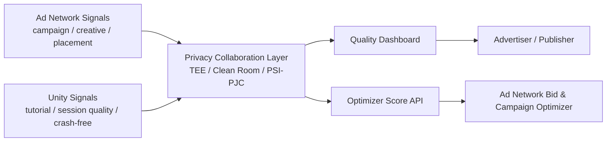
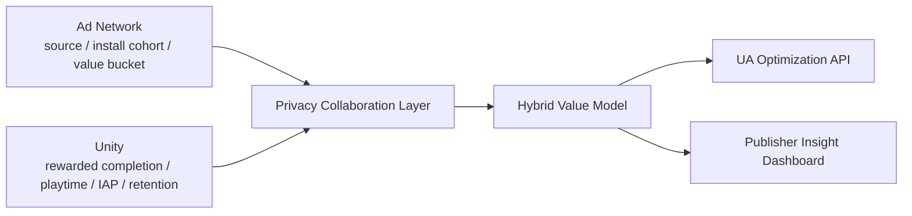
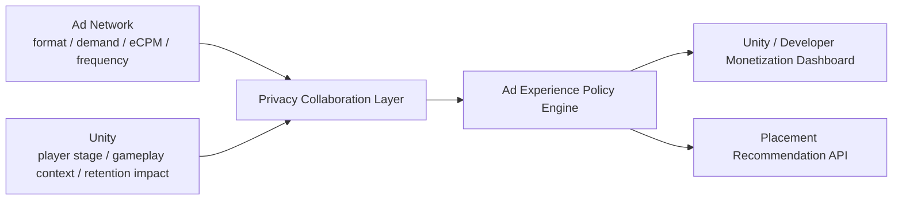
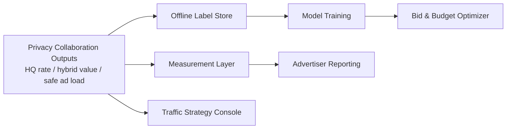

# Unity x Ad Network 隐私安全数据协作方案

## 1. 文档目的

本文档从 `mobile ad network` 公司的视角，构思一套与 `Unity` 开展隐私安全数据交换和联合优化的整体解决方案。本文重点关注：

- 为什么 Unity 侧数据对 ad network 有独特价值
- 这些数据与 MMP 数据的差异与互补关系
- ad network 能向 Unity 反向提供哪些有价值的数据与能力
- 双方在不交换原始用户级数据的前提下，可以做哪些联合分析和优化
- 这些合作对应的产品价值、商业模式和分阶段落地路线

本文聚焦：

- 平台：`mobile game`
- 合作主体：`ad network` 与 `Unity`
- 重点方向：`归因增强` 与 `广告优化`

## 2. 高层判断

### 2.1 核心命题

从 ad network 视角，与 Unity 的合作不应被定义为“获取更多数据”，而应被定义为：

- 将 `广告触达与竞价信号`
- 与 `游戏内真实价值形成过程`
- 在 `隐私保护约束下`
- 连接起来

一句话概括：

- MMP 告诉 ad network 用户从哪里来。
- Unity 告诉 ad network 这些用户在游戏里真正变成了什么样的人。

### 2.2 为什么对象是 Unity 而不是一般 SDK 厂商

Unity 的特殊性不只是它是一个引擎，而是它在移动游戏生态中同时接近：

- 游戏运行时
- 游戏内行为语义
- 开发者工作流
- 广告/变现/增长产品线
- 大量开发者与大量游戏的横向视角

因此，Unity 可提供的价值，不是“又一个 measurement source”，而是：

- 更深的游戏语义
- 更早的质量信号
- 更贴近真实玩家体验的上下文

## 3. 参与方与合作目标

### 3.1 参与方

- `Ad Network`
  - 持有广告触达、竞价、创意、归因候选和流量质量信号
- `Unity`
  - 持有游戏运行时、开发者接入、游戏内行为、广告位与变现语义
- `Game Developer / Publisher`
  - 最终购买或使用双方联合产品能力的一方
- `MMP`
  - 仍然在归因与 measurement 体系中扮演重要角色，但不是本合作的唯一价值来源

### 3.2 合作目标

从 ad network 视角，合作目标应优先围绕三件事：

1. 更早、更准地识别高质量用户
2. 更好地优化广告体验与广告变现，而不是只优化短期收入
3. 在不交换原始用户级数据的前提下，建立可复用的数据协作能力层

## 4. Unity 可提供的数据地图

本节重点讨论 Unity 理论上可以接触到哪些数据，以及这些数据对 ad network 为什么重要。

### 4.1 用户粒度运行时数据

这类数据最贴近玩家的真实游戏体验。

可能包括：

- session 时长、频率、活跃窗口
- 首次启动、二次启动、会话中断
- crash、ANR、加载失败
- FPS、卡顿、设备性能分层
- 网络质量、资源下载成功率
- 版本更新后的行为变化

对 ad network 的价值：

- 可更早识别“低质量安装”与“高潜力安装”
- 可判断某些流量来源是否带来 crash-prone 或弱体验用户
- 可构建 `crash-adjusted quality`、`performance-adjusted retention` 等质量指标

### 4.2 游戏内行为数据

这类数据是 Unity 相比 MMP 的关键优势来源。

可能包括：

- tutorial completion
- level progression
- 关卡失败/通过
- 角色、武器、build 选择
- 软硬货币获取与消耗
- 任务完成率
- match 结果
- 社交、公会、匹配、连续活跃
- 广告观看前后行为变化
- IAP 前序行为路径

对 ad network 的价值：

- 能判断某个 campaign 带来的用户是否真正进入核心玩法
- 能构建“游戏原生质量”而不是“安装后是否购买”这种更晚的指标
- 能帮助 ad network 做更好的 post-install optimization

### 4.3 游戏产品 meta 数据

这类数据不是单用户数据，但对优化非常关键。

可能包括：

- 游戏类型、题材、子品类
- IAA / IAP / hybrid 变现结构
- 广告位设计
- 关卡结构与经济系统风格
- liveops 和活动节奏
- 版本迭代节奏
- AB 实验配置

对 ad network 的价值：

- 可将 UA 和 creative 优化与游戏品类语义关联
- 可帮助 ad network 更精准地理解不同游戏商业模型的价值形成机制
- 可支持创意和 demand routing 优化

### 4.4 开发者接入与工作流数据

Unity 还可能接近很多纯 MMP 看不到的数据层。

可能包括：

- SDK 集成状态
- 广告位配置
- mediation 配置
- 包体版本
- 项目 instrumentation 覆盖率
- 插件和 package 使用情况

对 ad network 的价值：

- 可识别数据质量问题来自产品、SDK 还是 measurement 偏差
- 可更好支持开发者接入、排查问题和做产品建议

### 4.5 聚合生态基准数据

如果 Unity 从平台层面对大量游戏有聚合基准能力，那么它还可能提供：

- 某品类 D1 / D7 / D30 留存区间
- 某广告位完成率 benchmark
- 某设备档位的 crash / monetization 关系
- 某品类中 IAA / IAP 最优平衡带

对 ad network 的价值：

- 帮助它把优化从单账户经验提升到品类级 intelligence

## 5. Unity 数据与 MMP 数据的差异

这一部分非常关键，因为合作的价值要建立在“增量信息”上，而不是重复信息上。

### 5.1 MMP 更擅长的部分

MMP 通常更强在：

- install / reinstall / reopen
- media source / campaign / creative attribution
- click / impression 侧 measurement
- SAN / SRN 归因链路
- ad revenue callback
- 跨媒体统一 measurement

### 5.2 Unity 更擅长的部分

Unity 更强在：

- 游戏运行时质量
- 游戏内行为和玩法语义
- 广告位和变现设计上下文
- 版本与开发者配置
- 玩家价值形成过程，而不只是转化结果

### 5.3 价值差异的本质

一句话总结：

- `MMP 更像结果层`
- `Unity 更像机制层`

MMP 可以告诉 ad network：

- 这个 campaign 带来了多少安装和购买

Unity 可以告诉 ad network：

- 这些用户是否完成教程
- 是否顺利进入核心玩法
- 是否因为性能问题流失
- 是否广告看得动、留得住、且不会伤害长期价值

### 5.4 为什么这对 ad network 有意义

这意味着 ad network 可以从：

- 只优化安装和后置购买

升级到：

- 优化游戏原生质量
- 优化 hybrid LTV
- 优化玩家体验与长期收益的平衡

## 6. Ad Network 可提供给 Unity 的数据与能力

合作必须是双向的。Unity 只有在明确获益的情况下，才会认真投入。

### 6.1 触达与投放数据

ad network 可提供：

- impression
- click
- bid / win / loss bucket
- campaign / ad group / placement
- frequency / recency
- geo / device tier
- CTR / CVR / eCPM / fill rate

Unity 可从中获得：

- 更完整的外部流量画像
- 更好的变现和用户获取上下文
- 面向开发者的增长建议能力

### 6.2 创意与需求语义

ad network 可提供：

- creative type
- creative family
- 素材长度
- playable / video / static
- creative embedding 或 category bucket
- CTA 风格

Unity 可从中获得：

- 创意与游戏场景匹配规律
- 广告体验优化建议
- 更好的开发者 monetization 产品素材洞察

### 6.3 价值和风险信号

ad network 可提供：

- predicted quality bucket
- value bucket
- fraud risk bucket
- ad quality label
- auction competitiveness bucket

Unity 可从中获得：

- 质量分层能力
- 风险流量识别能力
- 对开发者更有价值的增长/变现建议

### 6.4 聚合市场 intelligence

ad network 可提供：

- 品类级 demand trend
- 地区级 CPM 波动
- creative fatigue 信号
- demand density 变化

Unity 可从中获得：

- 更强的 benchmark 产品
- 更强的运营建议与增长产品能力

## 7. 双方联合可做什么

本节重点讨论在不交换原始用户级数据的情况下，双方最值得做的事。

### 7.1 用例一：Quality Beyond Attribution

目标：

- 用 Unity 的游戏内语义增强 ad network 的 post-install quality 理解

可回答的问题：

- 哪个 campaign 带来的用户真正完成教程
- 哪个 creative 带来的用户 crash 风险更低
- 哪个 source 带来的用户更快进入核心循环

输出形式：

- campaign-level high quality user rate
- creative-level early engagement score
- crash-adjusted D1 quality

商业价值：

- ad network 能提供更强的 UA 优化
- 开发者看到的不只是购买，而是更真实的用户质量

### 7.2 用例二：Monetization-Aware UA

目标：

- 联合理解 IAA 与 IAP 的综合价值，而不是只看单一目标

可回答的问题：

- 哪些流量来源带来的用户更适合 hybrid monetization
- 哪些用户更可能形成广告收入而不是付费
- 哪些 source 虽然 purchase 少，但综合 LTV 高

输出形式：

- hybrid LTV bucket
- ad-engagement-adjusted quality score
- source-by-genre quality matrix

商业价值：

- 对混合变现游戏特别重要
- ad network 可把优化目标从单纯 purchase 扩展到综合价值

### 7.3 用例三：Ad Experience Intelligence

目标：

- 联合优化广告体验与长期留存，而不是单纯追求短期广告收入

可回答的问题：

- 哪个玩家阶段适合展示 rewarded
- 哪个设备段/游戏品类对广告频控最敏感
- 哪种广告格式会显著伤害长期留存

输出形式：

- ad load safe zone
- rewarded timing recommendations
- retention-safe monetization benchmark

商业价值：

- ad network 从卖量平台升级为体验优化伙伴
- Unity 可把这类洞察卖给开发者

### 7.4 用例四：Creative × Gameplay Fit

目标：

- 把创意优化从“素材点击率”提升到“素材是否带来适合该游戏的用户”

可回答的问题：

- 哪类创意更适合 midcore / casual / simulation 游戏
- 哪类创意带来的用户更容易在某玩法中留存
- 哪类创意虽然短期点击强，但带来的玩家质量差

输出形式：

- creative family quality map
- genre-to-creative compatibility score

商业价值：

- ad network 可获得更强 creative routing 能力
- Unity 可形成更强的开发者增长策略建议

### 7.5 用例五：Privacy-Preserving Fraud Correlation

目标：

- 利用双方各自的风险信号，做更强的质量判定而不共享原始明细

可回答的问题：

- 某些异常 session 是否与已知低质量流量强相关
- 某些 source 是否带来异常行为模式用户

输出形式：

- aggregate fraud correlation
- source risk uplift

商业价值：

- 降低低质量流量
- 提高投放与 monetization 的长期稳定性

## 8. 数据匹配与隐私保护思路

### 8.1 不推荐的方式

不应做：

- 双方直接交换原始用户级日志
- 使用长期稳定明文标识符做大范围 join
- 直接输出用户级交集结果
- 让一方获得另一方完整 coverage map

### 8.2 推荐的基本原则

- 用 task-specific、短生命周期、不可逆的 join artifact
- join 后只输出聚合结果
- 默认启用阈值和最小群体规模保护
- 报表层叠加差分隐私或至少阈值裁剪

### 8.3 三层隐私架构

#### 第一层：聚合 clean room

适合最先落地。

能力：

- 双方仅贡献聚合统计
- 在 TEE 或 confidential clean room 中做联合分析
- 最终输出聚合结果

适合场景：

- genre × campaign × quality 的聚合分析
- ad load 与 retention 的聚合关系

技术：

- TEE
- confidential clean room
- thresholding
- DP reporting

#### 第二层：私密匹配后的聚合分析

这是最推荐的主战场。

能力：

- 双方通过 task-specific join key 对齐用户群
- 不暴露 raw intersection
- 只输出 matched aggregate results

适合场景：

- matched high-quality user rate
- matched hybrid LTV
- matched tutorial completion

技术：

- PSI
- PJC / PI-Sum
- TEE-based matching
- post-aggregation DP

#### 第三层：协同建模

能力：

- 双方联合训练质量模型或价值模型
- 不直接共享原始训练样本

适合场景：

- 预测 high-LTV user
- 预测 ad-tolerant player
- creative-to-player fit scoring

技术：

- federated analytics
- federated learning
- confidential federated computations

### 8.4 为什么不建议一开始就做最强协议

虽然从理论上，多方 MPC 或最复杂的联邦建模很强，但第一阶段的商业目标应该是：

- 先验证数据互补是否真的能带来优化 uplift
- 先建立双方的合作信任和产品价值

因此，建议先从：

- 聚合 clean room
- 然后再进到 PSI / PJC

## 9. 解决方案总体设计

### 9.1 产品名称建议

可将方案命名为：

- `Game-Native Quality Exchange`
- 或 `Privacy-Preserving Game Growth Intelligence`

### 9.2 产品定位

一个面向 mobile 游戏开发者和发行商的隐私安全联合增长产品，连接：

- ad network 的触达、竞价、创意、价值信号
- Unity 的游戏内行为、性能、产品语义和开发者生态位置

目标是提升：

- acquisition quality measurement
- post-install optimization
- monetization optimization
- long-term LTV understanding

### 9.3 产品交付形式

建议采用三种输出形态：

#### 1. 洞察面板

面向：

- 广告主 / 发行商
- Unity 生态内开发者

内容：

- campaign quality dashboard
- genre and creative benchmark
- monetization-safe growth insights

#### 2. 优化 API / score

面向：

- ad network 内部优化系统
- bidder / campaign optimizer

内容：

- high-quality user score bucket
- hybrid value bucket
- creative compatibility score

#### 3. Benchmark 产品

面向：

- Unity 开发者生态

内容：

- 品类级 benchmark
- monetization / retention 平衡建议
- ad experience recommendations

## 9A. 产品方案版本：三个端到端 Use Case

本节将前文的方向性方案收敛为更接近产品落地的版本。重点不是列出全部可能性，而是挑选最适合 ad network 与 Unity 启动合作的三个产品化 use case。

筛选标准：

- 必须能体现 Unity 数据相对 MMP 的独特增量价值
- 必须能给 ad network 的归因和广告优化带来直接收益
- 必须能在隐私约束下先落成一个可售卖、可验证的产品

### 9A.1 Use Case 1: Quality Beyond Attribution

#### 产品定义

这是一款面向广告主 / 发行商的联合质量洞察产品。

它不只回答：

- 哪个 campaign 带来了安装和购买

还回答：

- 哪个 campaign 带来了真正进入核心玩法、体验稳定、早期留存更好的玩家

#### 目标用户

- UA 团队
- 发行商增长团队
- ad network 内部 campaign optimizer

#### 痛点

传统 MMP 视角下，广告主看到的是：

- install
- purchase
- D1 / D7 留存

但看不到：

- 用户是否完成教程
- 是否因为性能问题流失
- 是否只是“假活跃”
- 哪个 creative 带来的用户真正进入核心循环

#### 产品输入

来自 ad network：

- campaign / creative / placement / geo
- click / impression / source
- value bucket
- fraud risk bucket

来自 Unity：

- tutorial completion
- first-session depth
- crash-free early experience
- level progression
- session quality score

#### Mock Data Flow 示例

ad network 侧原始 cohort 输入：

```text
campaign_id | creative_id | installs
C_A         | CR_X        | 1000
C_A         | CR_Y        | 400
C_B         | CR_Z        | 900
```

Unity 侧原始 cohort 输入：

```text
campaign_id | tutorial_complete | crash_free_d1 | early_core_loop_users
C_A         | 620               | 780           | 510
C_B         | 410               | 640           | 300
```

在隐私协作层中的联合输出：

```text
campaign_id | hq_user_rate | tutorial_completion_rate | crash_adjusted_quality
C_A         | 0.52         | 0.62                     | high
C_B         | 0.33         | 0.46                     | medium-low
```

业务含义：

- 虽然 `C_A` 和 `C_B` 都可能带来大量安装
- 但 `C_A` 带来的用户更可能真正进入核心玩法，且早期体验更稳定
- ad network 可以更早把预算向 `C_A` 倾斜，而不必等更慢的 purchase/ROAS 信号

#### 产品输出

- `High-Quality User Rate`
- `Tutorial Completion Rate by Campaign`
- `Crash-Adjusted Early Retention`
- `Creative Quality Lift`

#### 输出示例

```text
Campaign A:
- Install volume: high
- Purchase rate: medium
- Tutorial completion: high
- Crash-adjusted D1 quality: high

Campaign B:
- Install volume: high
- Purchase rate: similar
- Tutorial completion: low
- Crash-adjusted D1 quality: low
```

含义：

- 这时 ad network 可以更早判断 Campaign A 的真实质量更高，而不是等更长周期的 purchase / ROAS 数据。

#### 输出粒度与边界

允许输出：

- campaign-level HQ rate
- creative-family-level quality bucket
- geo / genre 层级的 aggregate quality

不允许输出：

- raw player-level tutorial event
- exact gameplay trajectory
- cross-party matched player list
- 小样本群体的未阈值化结果

#### 端到端流程

1. ad network 输出 campaign / creative 维度的触达与 install cohort
2. Unity 输出对应 cohort 的游戏内早期质量指标
3. 双方在 clean room 或 matched aggregate 层完成联合分析
4. 最终生成 campaign-level 质量看板和优化信号
5. 广告主和 ad network 优化器据此调整预算和创意策略

#### 数据流示意



#### 隐私技术建议

第一阶段：

- TEE clean room
- 聚合 cohort join
- thresholding + DP reporting

第二阶段：

- PSI / PJC for matched aggregate quality

第三阶段：

- federated quality modeling

不推荐一开始就做：

- full MPC
- 用户级原始日志互传
- 直接输出精细 cross-party player join

#### 商业化方式

- 作为高级质量分析模块卖给广告主
- 或作为 ad network 的 premium optimization capability

### 9A.2 Use Case 2: Monetization-Aware UA

#### 产品定义

这是一款把用户获取与变现结果联动起来的联合优化产品。

核心目标不是只判断：

- 谁会购买

而是判断：

- 谁会形成更高的混合价值，即 `IAP + IAA + retention-adjusted value`

#### 目标用户

- 混合变现游戏的增长团队
- ad network 内部 value optimization 团队
- Unity 增长和 monetization 产品团队

#### 痛点

很多 mobile game 已经不是纯 IAP 或纯 IAA，而是 hybrid model。

如果只看 purchase，容易低估：

- 高广告观看但不付费的高价值用户
- 长期留存好、后期才付费的用户
- 对 rewarded 反应好、整体 LTV 不差的用户

#### 产品输入

来自 ad network：

- campaign / source / creative
- install cohort
- ad delivery value bucket
- source quality bucket

来自 Unity：

- ad engagement
- rewarded completion
- ad fatigue proxy
- in-game economy progression
- purchase events
- retention-adjusted playtime

#### Mock Data Flow 示例

ad network 侧原始输入：

```text
source | installs | click_to_install_rate | ad_side_value_bucket
S1     | 500      | high                  | medium
S2     | 520      | medium                | medium
```

Unity 侧原始输入：

```text
source | rewarded_completion_users | iap_users | d7_playtime_bucket
S1     | 260                       | 40        | high
S2     | 110                       | 55        | medium
```

联合输出：

```text
source | hybrid_ltv_bucket | ad_engagement_adjusted_quality
S1     | high              | high
S2     | medium            | medium
```

业务含义：

- `S2` 的购买人数可能略高
- 但 `S1` 的广告互动和长期活跃更强
- 对 hybrid monetization 游戏来说，`S1` 反而更值得加预算

#### 产品输出

- `Hybrid LTV Bucket`
- `Ad-Engagement-Adjusted Quality Score`
- `Source-by-Genre Hybrid Value Matrix`
- `Monetization Mix Recommendation`

#### 输出示例

```text
Source X:
- Purchase rate: medium
- Rewarded completion: high
- D7 playtime: high
- Hybrid LTV bucket: high

Source Y:
- Purchase rate: slightly higher
- Rewarded completion: low
- D7 playtime: low
- Hybrid LTV bucket: medium
```

含义：

- 传统 purchase 视角可能更偏向 Source Y
- 但从真实混合价值看，Source X 更值得加预算

#### 输出粒度与边界

允许输出：

- source-level hybrid value bucket
- genre-level monetization mix recommendation
- campaign-level value uplift bucket

不允许输出：

- player-level ad watch history
- 精确 IAP 明细账单
- 用户级 ad + IAP 组合轨迹

#### 端到端流程

1. ad network 输出 source / campaign 维度的 install 和 ad-side value bucket
2. Unity 输出对应 cohort 的广告互动和游戏内价值形成指标
3. 双方在隐私层中计算 hybrid value segment
4. 输出 hybrid LTV 看板和 optimizer score
5. ad network 将分数回灌到 campaign bidding / budget allocation 中

#### 数据流示意



#### 隐私技术建议

- 优先使用 matched aggregate analysis
- 中期引入 PJC / PI-Sum 计算 cohort-level mixed value
- 报表层继续使用阈值和 DP

后期可选：

- federated value modeling

不推荐一开始就做：

- 逐用户价值明细共享
- 高频实时的 cross-party raw join

#### 商业化方式

- 作为 “better ROAS for hybrid games” 的高级增值模块
- 或与 ad network 的 value optimization 能力绑定销售

### 9A.3 Use Case 3: Ad Experience Intelligence

#### 产品定义

这是一款面向变现优化的联合产品，用来寻找“广告收益”和“玩家体验”之间更优的平衡点。

核心不是：

- 广告能不能多展示一点

而是：

- 在什么玩家阶段、什么设备段、什么游戏语义上下文里展示广告，既赚钱又不明显伤害留存

#### 目标用户

- 变现团队
- 游戏运营团队
- Unity monetization / mediation 产品团队
- ad network monetization optimization 团队

#### 痛点

当前很多广告优化仍然只盯：

- eCPM
- fill rate
- show rate
- revenue per DAU

但缺少对以下问题的统一理解：

- 某次展示是否打断了关键游戏体验
- 某类 rewarded placement 是否提高了长期粘性
- 某类用户是否已进入 ad fatigue 区间

#### 产品输入

来自 ad network：

- ad format
- demand density
- eCPM bucket
- creative family
- frequency / recency

来自 Unity：

- player stage
- gameplay context
- device performance tier
- ad placement context
- session interruption sensitivity
- retention after exposure

#### Mock Data Flow 示例

ad network 侧输入：

```text
format       | ecpm_bucket | frequency_bucket | demand_density
rewarded     | high        | medium           | high
interstitial | medium      | high             | high
```

Unity 侧输入：

```text
player_stage       | device_tier    | interruption_sensitivity | post_ad_retention_bucket
early_progression  | low_end        | high                     | low_if_interstitial_heavy
mid_progression    | mid_high_end   | medium                   | stable
```

联合输出：

```text
segment                              | recommended_policy
early_progression_low_end_users      | rewarded_yes_interstitial_low
mid_progression_mid_high_end_users   | rewarded_yes_interstitial_medium
```

业务含义：

- 对早期玩家和低端设备用户，激进插屏虽然短期能赚钱，但长期 retention penalty 太高
- 因此更适合 reward-first 的 monetization 策略

#### 产品输出

- `Ad Load Safe Zone`
- `Rewarded Timing Recommendation`
- `Format-by-Context Fit Score`
- `Retention-Safe Monetization Benchmark`

#### 输出示例

```text
Game Genre: Casual Puzzle
Player Stage: Early progression
Device Tier: Low-end Android

Recommended:
- Rewarded: yes
- Interstitial: low frequency
- Max ad load bucket: medium-low

Reasoning summary:
- High interruption sensitivity
- Strong rewarded completion
- High retention penalty on aggressive interstitial pacing

#### 输出粒度与边界

允许输出：

- segment-level placement recommendation
- genre/device/player-stage 层级的 safe ad load bucket
- format-by-context fit score

不允许输出：

- 用户级实时游戏行为明细
- 单个玩家的广告耐受画像原始特征
- 可反推个体行为路径的未聚合上下文结果
```

#### 端到端流程

1. ad network 输出广告供给与展示价值信号
2. Unity 输出玩家阶段和游戏内上下文
3. 双方联合分析广告展示后对 session、留存和 monetization 的影响
4. 生成 placement policy recommendation
5. Unity 侧或开发者侧据此调整广告位策略

#### 数据流示意



#### 隐私技术建议

- 第一阶段用聚合 cohort 分析即可
- 第二阶段用 TEE-based confidential aggregation 做更细分的 context join
- 若做实时推荐，需把在线部分控制在 bucket/segment 级别，而不是用户级 raw feature 共享

后期可选：

- confidential context scoring
- federated recommendation modeling

不推荐一开始就做：

- 个体级实时联合决策
- 高维原始行为特征直接共享

#### 商业化方式

- 可作为 Unity monetization 产品的高级建议模块
- 也可作为 ad network 对发行商提供的 managed monetization optimization service

### 9A.4 三个 Use Case 的优先级建议

如果只能按 ad network 视角排优先级，我建议：

1. `Quality Beyond Attribution`
2. `Monetization-Aware UA`
3. `Ad Experience Intelligence`

原因：

- 第一项最容易证明 Unity 数据相对于 MMP 的增量价值
- 第二项最能直接转化成 ad network 的投放优化收益
- 第三项长期价值高，但需要更深的产品与运营配合

### 9A.5 产品打包建议

建议不要把这三项拆成完全独立的产品，而是打包成一个分层套件：

- `Foundation`
  - Quality Beyond Attribution
- `Growth`
  - Monetization-Aware UA
- `Monetization`
  - Ad Experience Intelligence

这样好处是：

- 先从最容易证明价值的洞察模块切入
- 再逐步进入更强的优化和推荐能力
- 销售路径更清晰，客户教育成本更低

### 9A.6 产品级 KPI 建议

对于这套产品，建议定义三类 KPI。

#### 业务 KPI

- advertiser adoption
- publisher adoption
- paid attach rate
- retention of partnered accounts

#### 效果 KPI

- campaign quality uplift
- hybrid LTV prediction uplift
- monetization lift without retention degradation

#### 技术 KPI

- 可用数据覆盖率
- join success rate
- query latency
- privacy budget / threshold compliance rate

### 9A.7 面向客户的话术建议

对外不要卖“我们有多强的密码学协议”，而要卖：

- 你现在只知道用户从哪里来
- 我们让你知道这些用户在游戏里到底有没有价值
- 而且这个过程不需要交换原始用户数据

也就是说：

- 隐私技术是底层能力
- 产品卖点是更高质量的增长与变现决策

## 9AA. Dashboard / Mock 输出页设计

这一节的目标是把前面的 use case 进一步产品化，回答一个更具体的问题：

- 如果这真的是一个会卖给客户的产品页面，它长什么样？

这里不追求视觉设计，而是定义：

- 页面模块
- 核心指标
- 推荐文案
- 客户一眼能看懂的价值表达

### 9AA.1 页面一：Quality Beyond Attribution Dashboard

#### 页面定位

面向：

- UA manager
- Publisher growth lead
- ad network account team

核心问题：

- 哪些 campaign / creative 带来的不是“表面转化”，而是真正高质量玩家

#### 页面结构

##### 模块 A：Executive Summary

建议展示：

```text
Headline:
Your top-quality acquisition source is not the same as your top-volume source.

Highlights:
- HQ User Rate uplift: +23%
- Best campaign by game-native quality: Campaign A
- Best creative family by early retention quality: Creative Family 3
```

##### 模块 B：Campaign Quality Table

Mock 表格：

| Campaign | Installs | Purchase Rate | Tutorial Completion | Crash-Adjusted D1 Quality | HQ User Rate | Recommendation |
| --- | --- | --- | --- | --- | --- | --- |
| C_A | 1000 | Medium | 62% | High | 52% | Increase budget |
| C_B | 900 | Medium | 46% | Medium-Low | 33% | Review creative / source mix |
| C_C | 700 | Low | 58% | High | 47% | Test for scale |

##### 模块 C：Creative Family Insights

建议展示：

```text
Creative Family 3:
- Lower CTR than Family 1
- Higher tutorial completion
- Higher early core-loop entry
- Better crash-adjusted quality

Insight:
This creative appears to attract fewer clicks but better-fitting users.
```

##### 模块 D：Quality Funnel

Mock 漏斗：

```text
Installs -> First Session -> Tutorial Complete -> Core Loop Entry -> HQ User
1000        910             620                 510                520
```

#### 页面核心价值

这个页面最想让客户看到的是：

- “量大”不等于“质量高”
- MMP-only 看不出来的游戏内质量差异，现在可以看出来

### 9AA.2 页面二：Monetization-Aware UA Dashboard

#### 页面定位

面向：

- Growth lead
- UA team
- Monetization lead

核心问题：

- 哪些 source / campaign 带来的是综合价值高的用户，而不是只在单一指标上表现好

#### 页面结构

##### 模块 A：Hybrid Value Summary

建议展示：

```text
Headline:
Source S1 delivers stronger hybrid value than Source S2 despite lower direct purchase signals.

Highlights:
- Best source for hybrid LTV: S1
- Best source for ad-engagement-adjusted value: S1
- Most overvalued by purchase-only view: S2
```

##### 模块 B：Source Comparison Table

Mock 表格：

| Source | Installs | Purchase Rate | Rewarded Completion | D7 Playtime | Hybrid LTV Bucket | Recommendation |
| --- | --- | --- | --- | --- | --- | --- |
| S1 | 500 | Medium | High | High | High | Increase budget |
| S2 | 520 | Medium-High | Low | Medium | Medium | Cap / segment more aggressively |
| S3 | 430 | Low | Medium | High | Medium-High | Test new creative routing |

##### 模块 C：Value Mix Panel

建议展示：

```text
Source S1 Value Mix:
- IAP contribution: medium
- IAA contribution: high
- Retention-adjusted value: high

Source S2 Value Mix:
- IAP contribution: medium-high
- IAA contribution: low
- Retention-adjusted value: medium
```

##### 模块 D：Budget Action Panel

建议展示：

```text
Recommended actions for next 7 days:
- Increase spend on S1 by 15%
- Hold S2 flat unless purchase CPA improves
- Expand S3 only for hybrid monetization titles
```

#### 页面核心价值

这个页面最想让客户理解的是：

- 单看 purchase 很容易低估 hybrid monetization 游戏的真实价值结构
- ad network 现在可以帮助客户做更聪明的预算配置

### 9AA.3 页面三：Ad Experience Intelligence Dashboard

#### 页面定位

面向：

- Monetization team
- LiveOps team
- Unity monetization success team

核心问题：

- 什么广告策略既能赚钱，又不会明显伤害玩家体验和长期留存

#### 页面结构

##### 模块 A：Experience Health Summary

建议展示：

```text
Headline:
Interstitial pressure is likely too high for early-stage low-end users.

Highlights:
- Safest monetization format: Rewarded
- Highest retention penalty segment: Early progression + low-end devices
- Largest optimization opportunity: Reduce interstitial load in segment E1
```

##### 模块 B：Segment Policy Table

Mock 表格：

| Segment | Current Policy | Revenue Impact | Retention Risk | Recommended Policy |
| --- | --- | --- | --- | --- |
| Early progression / low-end | Interstitial medium-high | Medium | High | Rewarded heavy, interstitial low |
| Mid progression / mid-high-end | Interstitial medium | Medium-High | Medium | Balanced mix |
| Late progression / high intent | Rewarded medium | High | Low | Increase rewarded opportunities |

##### 模块 C：Format-by-Context Heatmap

建议展示：

```text
Context Fit Score:
- Rewarded x Early Progression = High
- Interstitial x Early Progression = Low
- Rewarded x Mid Progression = High
- Interstitial x Late Progression = Medium
```

##### 模块 D：Policy Recommendation Feed

建议展示：

```text
Recommended policy changes:
- Reduce interstitial frequency for early-stage low-end users by one bucket
- Keep rewarded placements unchanged
- Test a low-pressure monetization strategy in Puzzle Tier-2 markets
```

#### 页面核心价值

这个页面最想让客户看到的是：

- 变现优化不是单纯追求 eCPM 更高
- 最优策略是收益、体验、长期留存三者的平衡

### 9AA.4 面向客户的页面设计原则

为了让产品更容易被市场接受，这类 dashboard 应遵循几个原则。

#### 原则 1：先讲业务结论，再讲指标

客户不想先看一堆指标定义，他们更想先知道：

- 我该把预算加到哪里
- 我该把广告频控改成什么
- 哪个 creative 更值得放量

#### 原则 2：不要把隐私技术放在页面中心

隐私是底层必要能力，但页面不应该写成：

- “我们用了 TEE / PJC / DP”

而应该写成：

- “这些洞察在不共享原始用户数据的前提下生成”

#### 原则 3：每页必须有明确动作建议

如果页面只有图和表，没有 action，则产品会看起来更像研究报告。

建议每页至少提供：

- budget recommendation
- source recommendation
- creative recommendation
- ad load recommendation

#### 原则 4：不要把粒度做得过细

客户当然总会想看更细的数据，但从隐私和产品稳定性角度：

- 优先展示 campaign / creative family / source / segment 级别
- 不要轻易下钻到接近用户级或极小样本群体

### 9AA.5 这类 Dashboard 如何与销售话术配合

这类页面最好的销售方式不是强调“技术先进”，而是强调：

- 传统归因告诉你谁带来了安装
- 我们告诉你谁带来了真正适合你游戏的玩家
- 而且这种洞察不需要交换原始用户数据

如果要把三页 dashboard 收敛成一句价值主张，可以写成：

- `Measure quality beyond installs, optimize value beyond purchases, and monetize beyond short-term eCPM.`

## 9B. 这些输出如何进入 Ad Network 内部系统

这一节回答一个非常关键的问题：

- 即使我们从 Unity 拿到了隐私保护后的联合输出，这些东西在 ad network 内部到底怎么被消费？

从 ad network 视角，最合理的是把这些输出接入四层系统。

### 9B.1 Measurement Layer

作用：

- 增强 campaign / source / creative 维度的质量报表

可接入的输出：

- HQ user rate
- tutorial completion bucket
- crash-adjusted quality
- hybrid LTV bucket
- ad experience safety bucket

用途：

- 替代“只看 install / purchase”的单薄视角
- 帮客户理解为什么某些 source 看似量大，长期质量却差

### 9B.2 Model Layer

作用：

- 给 ad network 内部模型提供更好的标签、弱监督或 bucket 特征

可接入的输出：

- campaign-level high quality label
- source-level hybrid value label
- creative-to-genre fit bucket

可增强的模型：

- pLTV
- pROAS
- churn risk
- quality score
- fraud risk

推荐方式：

- 初期把这些结果作为 offline label enrichment
- 中期再进入 online scoring / nearline feature pipeline

### 9B.3 Bidding Layer

作用：

- 影响出价和预算分配逻辑

可接入的输出：

- quality-adjusted expected value
- source quality multiplier
- hybrid value multiplier

典型用法：

- 对 HQ user rate 高的 source 提高 bid multiplier
- 对 crash-adjusted quality 低的 segment 降低出价
- 对 creative-to-genre fit 高的组合加大预算

### 9B.4 Traffic Strategy Layer

作用：

- 做更宏观的流量配置和供给策略

可接入的输出：

- source-by-genre quality matrix
- segment-level monetization recommendation
- retention-safe ad load policy

典型用法：

- publisher whitelist / blacklist 调整
- 预算重新分层
- creative routing
- game genre / region / device tier 层级的投放策略切换

### 9B.5 一个完整的内部消费链路

可以把 ad network 内部消费链路理解为：



一句话总结：

- 这些联合输出不应该只停留在 dashboard
- 它们应该变成 ad network 内部 measurement、model、bidding、traffic strategy 的共同输入

## 9C. Use Case 与隐私技术选型映射

为了让整份方案更容易执行，这里把三个 use case 对应的隐私技术路线收成一张表。

| Use Case | Phase 1 推荐 | Phase 2 推荐 | Phase 3 推荐 | 不建议起手式 |
| --- | --- | --- | --- | --- |
| Quality Beyond Attribution | TEE clean room + aggregate cohort analysis + thresholding | PSI / PJC for matched aggregate quality | Federated quality modeling | full MPC、raw user log sharing |
| Monetization-Aware UA | Aggregate clean room + governed reporting | PJC / PI-Sum for matched value | Federated value modeling | player-level value sharing、实时 raw join |
| Ad Experience Intelligence | Aggregate contextual analysis | TEE-based confidential context join | Confidential / federated recommendation modeling | 个体级实时联合决策、高维 raw feature 共享 |

### 9C.1 简化理解

- 如果目标是“先证明商业价值”，优先 clean room / TEE / 聚合分析
- 如果目标是“更强 measurement 和 value attribution”，优先 PSI / PJC
- 如果目标是“更强自动优化”，最后再上 federated modeling

## 9D. 为什么 Unity 也会愿意合作

虽然这份文档是站在 ad network 视角写的，但真正的合作必须是双赢。

Unity 愿意合作的原因，不应该被简单理解成“帮助 ad network 更赚钱”，而应该是：

### 9D.1 对 Unity Grow / Ads / Mediation 生态的增强

合作能让 Unity 提供更强的：

- growth insights
- monetization insights
- benchmark 产品
- ad experience recommendations

### 9D.2 对开发者价值的增强

Unity 可以对开发者讲的故事会变得更强：

- 你不只知道买来了多少用户
- 你还能知道这些用户在游戏里是否真正有价值
- 还能知道广告怎么放更不伤体验

### 9D.3 对商业模式的增强

Unity 可以把这些能力做成：

- premium insight package
- monetization advisory
- growth intelligence module
- benchmark subscription

### 9D.4 对战略位置的增强

更重要的是，Unity 会更接近一种更强的定位：

- 不只是游戏引擎
- 而是“游戏增长与变现操作系统”的一部分

## 10. 从 Ad Network 视角的价值

### 10.1 直接价值

- 更快识别真正高质量流量
- 更强的 post-install quality signal
- 更好的 campaign 和 creative 优化
- 更好的 hybrid LTV 理解

### 10.2 长期战略价值

- 从“媒体投放平台”升级为“游戏原生增长智能平台”
- 建立比传统 MMP-only 优化更强的差异化能力
- 获得更稳固的开发者与发行商关系

## 11. 从 Unity 视角的价值

### 11.1 对 Unity 产品线的价值

Unity 不只是引擎，也拥有广告、增长和开发者服务相关产品线。因此该合作可增强 Unity 在以下方面的能力：

- 更强的开发者增长建议
- 更强的 monetization insight
- 更强的 benchmark 产品
- 更强的广告体验优化建议

### 11.2 对 Unity 商业模式的价值

Unity 可借此：

- 增强现有 Grow / Ads / Mediation 生态价值
- 形成高级开发者数据产品
- 通过更高价值的增长产品提高商业黏性

## 12. 商业模型设计

从 ad network 视角，我建议优先考虑以下三种商业模型。

### 12.1 模型 A：联合洞察产品

定义：

- 双方把联合数据能力包装成开发者和发行商可购买的 insight product

产品形态：

- quality dashboard
- hybrid monetization insights
- creative-to-genre fit insights

收入模式：

- SaaS 订阅
- enterprise analytics package
- premium benchmark license

优点：

- 风险低
- 容易起步
- 容易验证市场需求

### 12.2 模型 B：联合优化分成

定义：

- 双方把合作能力嵌入投放优化与广告优化系统，并按 uplift 分成

产品形态：

- higher quality UA optimization
- monetization-aware growth optimization
- ad experience optimization

收入模式：

- performance fee
- take-rate uplift share
- managed optimization fee

优点：

- 收入与效果挂钩
- 价值更直接

难点：

- 归因和 uplift 证明要求更高

### 12.3 模型 C：平台能力嵌入

定义：

- ad network 向 Unity 提供 privacy-preserving signal enrichment capability

产品形态：

- 嵌入 Unity 的开发者产品
- 面向开发者隐藏技术复杂度

收入模式：

- API / compute fee
- strategic rev share
- platform partnership contract

### 12.4 推荐顺序

建议：

- 先从 `模型 A` 起步
- 验证 value uplift 后再走向 `模型 B`

因为对于新合作，最重要的是先证明：

- 联合信号的确有增量价值
- 开发者确实愿意为这种 insight 买单

## 13. 分阶段落地路线

### 13.1 第一阶段：聚合洞察验证

目标：

- 验证 Unity 数据与 ad network 数据是否存在真实增量价值

能力：

- 聚合 clean room
- genre / campaign / creative / retention / monetization 联合分析

输出：

- 初版 dashboard
- benchmark 报告
- 若干设计伙伴案例

成功标准：

- 能证明至少一类 quality metric 比 MMP-only 更有效

### 13.2 第二阶段：matched aggregate quality

目标：

- 在不共享 raw user data 的前提下，做更强的 user-quality 对齐

能力：

- task-specific join key
- PSI / PJC / PI-Sum
- aggregate quality measurement

输出：

- matched high-quality user rate
- matched hybrid LTV score
- source quality enhancement

成功标准：

- 能证明对 UA 优化或 ad monetization 优化有显著 uplift

### 13.3 第三阶段：协同优化

目标：

- 让联合信号进入 ad network 的优化引擎和 Unity 的开发者产品中

能力：

- federated analytics
- confidential modeling
- optimization score service

输出：

- real-time 或 near-real-time score
- 联合优化产品

成功标准：

- 成为持续可商业化的产品能力，而不是一次性研究项目

## 14. 关键风险与控制点

### 14.1 风险一：数据价值并不增量

控制方式：

- 第一阶段先做小范围验证
- 聚焦 2-3 个最强用例，而不是泛化合作

### 14.2 风险二：隐私复杂度过高导致无法落地

控制方式：

- 先从 clean room + aggregate analysis 起步
- 不要一开始就做最重协议

### 14.3 风险三：合作价值偏向一方

控制方式：

- 明确 Unity 的商业收益
- 把合作设计成双向产品，而不是单向数据采购

### 14.4 风险四：销售话术过于技术化

控制方式：

- 对外卖点不强调密码学
- 强调的是：
  - 更高质量用户
  - 更优变现与体验平衡
  - 更好的开发者增长洞察

## 15. 最终建议

从 ad network 视角，最值得做的不是“把 Unity 当成另一个 measurement provider”，而是：

- 把 Unity 当成“游戏内真实价值语义层”
- 把合作定位为“隐私保护的游戏原生增长智能”
- 先用聚合和 matched aggregate 的方式验证增量价值
- 最终把它产品化为：
  - 联合洞察产品
  - 联合优化能力
  - 开发者 benchmark 与增长服务

最推荐的启动顺序：

1. `Quality Beyond Attribution`
2. `Monetization-Aware UA`
3. `Ad Experience Intelligence`

这三者最容易体现 Unity 数据相对 MMP 的独特增量价值，也最容易转化为可销售的产品故事。
